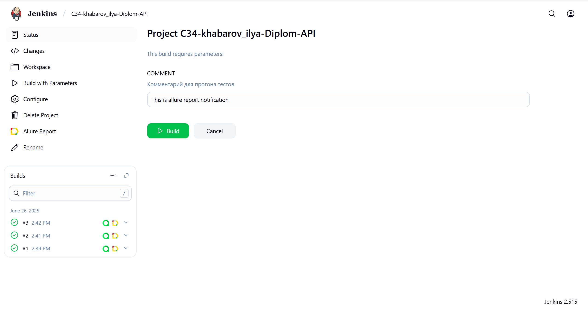
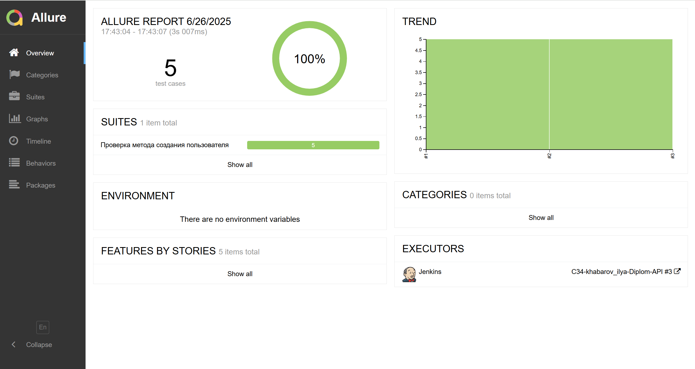
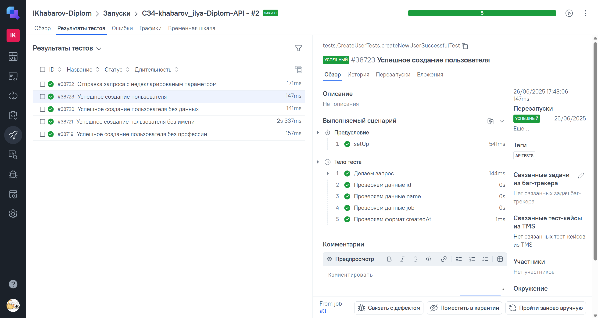
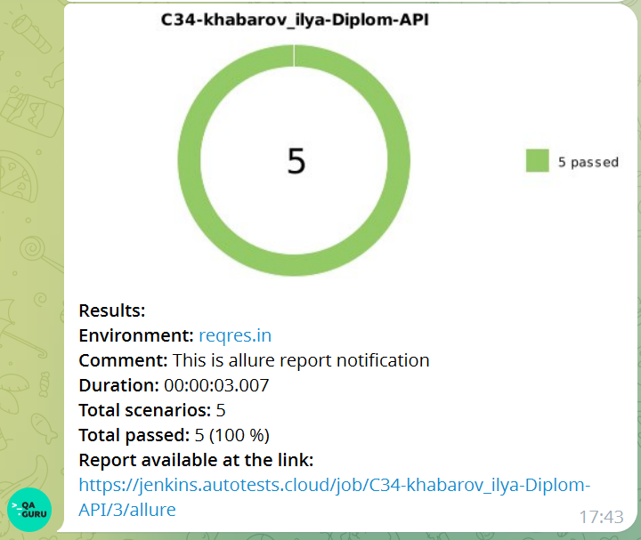

<p align="center">

</p>

# Проект по автоматизации тестовых сценариев для компании [Reqres.in](https://reqres.in/)

## 🔽 Содержание
- Используемый стек
- Реализованные проверки
- Запуск тестов из терминала
- Запуск тестов из Jenkins
- Сборка в Jenkins
- Содержание Allure-отчета
- Пример Allure-отчета
- Отчет и кейсы в Allure-TestOps
- Уведомления в Telegram с использованием бота

## 🔽 Используемый стек

<p align="center">


</p>

Тесты в данном проекте написаны на языке <code>Java</code>, сборщик - <code>Gradle</code>. <code>JUnit 5</code> задействован в
качестве фреймворка модульного тестирования. Использован так же подход <code>RestAssured</code>.
Для удаленного запуска реализована джоба в <code>Jenkins</code> с формированием Allure-отчета и отправкой результатов
в <code>Telegram</code> при помощи бота. Тесты, описанные в коде и их результаты автоматически синхронизируются <code>Allure TestOps</code>.

## 🔽 Реализованные проверки

* Проверка успешного создания пользователя
* Проверка успешного создания пользователя без имени
* Проверка успешного создания пользователя без профессии
* Проверка успешного создания пользователя без данных
* Проверка отправки запроса с недекларированным параметром

## 🔽 Запуск автотестов

### Запуск тестов из терминала

```
gradle clean ApiTests
```

При выполнении данной команды в терминале IDE тесты запустятся локально.

### Запуск тестов из Jenkins

```
clean ApiTests
```

##  Сборка в [Jenkins](https://jenkins.autotests.cloud/job/C34-khabarov_ilya-Diplom-API/)

Для запуска сборки необходимо перейти в раздел <code>Buld with parameters</code>, выбрать нужные параметры запуска
автотестов и нажать кнопку <code>Build</code>.
<p align="center">

</p>
После выполнения сборки, в блоке <code>Builds</code> напротив номера сборки появятся значки <code>Allure Report</code> и <code>Allure TestOps</code>, при клике на которые откроется страница со сформированным html-отчетом и тестовой документацией соответственно.

## 🔽 Содержание Allure-отчета

* Шаги теста
* Шаги проверок
* Запрос и ответ

##  Пример [Allure-отчета](https://jenkins.autotests.cloud/job/C34-khabarov_ilya-Diplom-API/3/allure/)

<p align="center">

</p>

##  Отчет и кейсы в [Allure-TestOps](https://allure.autotests.cloud/launch/47045)
В результате запуска job'ы в Jenkins в дипломном проекте в Allure TestOps добавлется отчет и кейсы.
<p align="center">

</p>

##  Уведомления в Telegram с использованием бота

После завершения сборки специальный бот, созданный в <code>Telegram</code>, автоматически обрабатывает и отправляет
сообщение с отчетом о прогоне тестов.

<p align="center">

</p>
